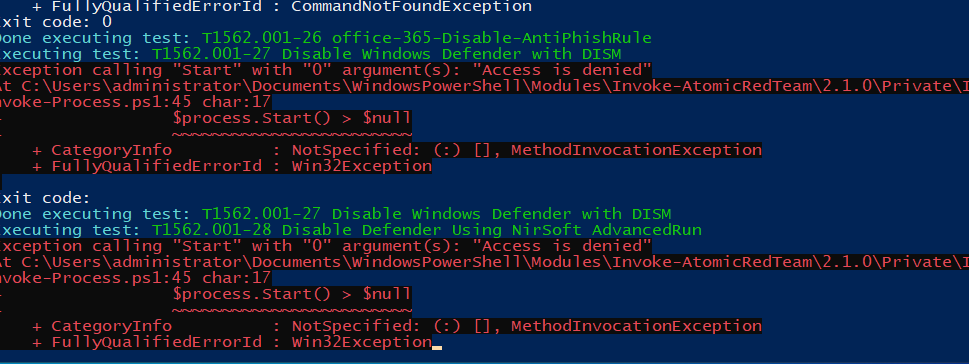
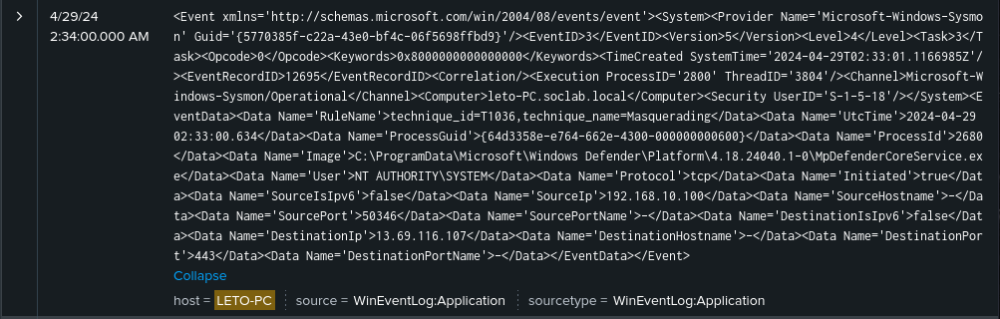
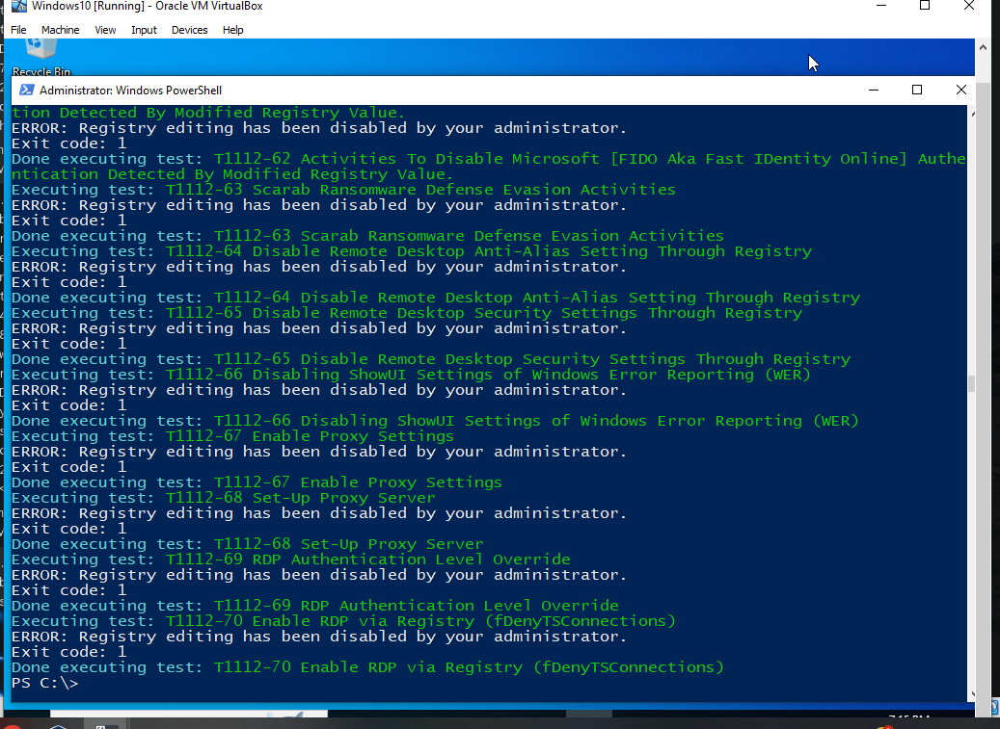
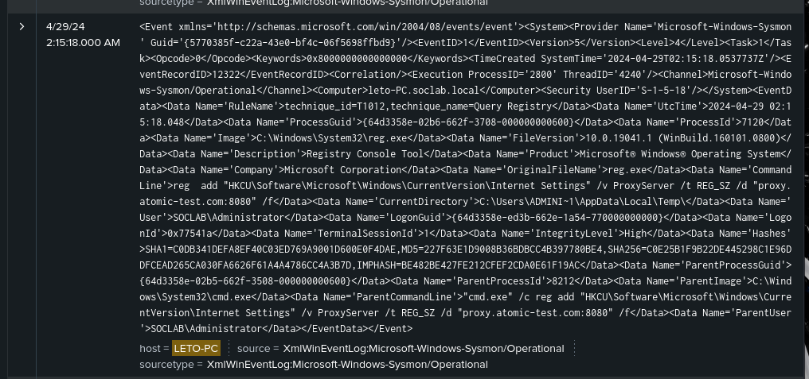
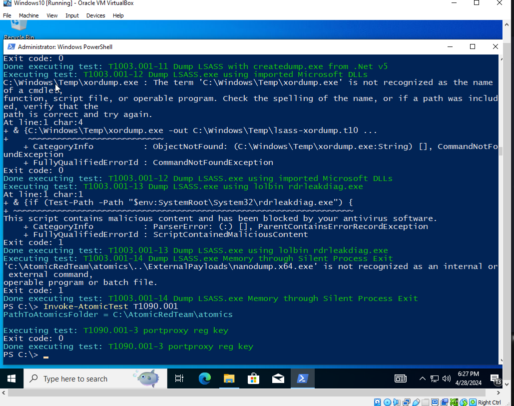
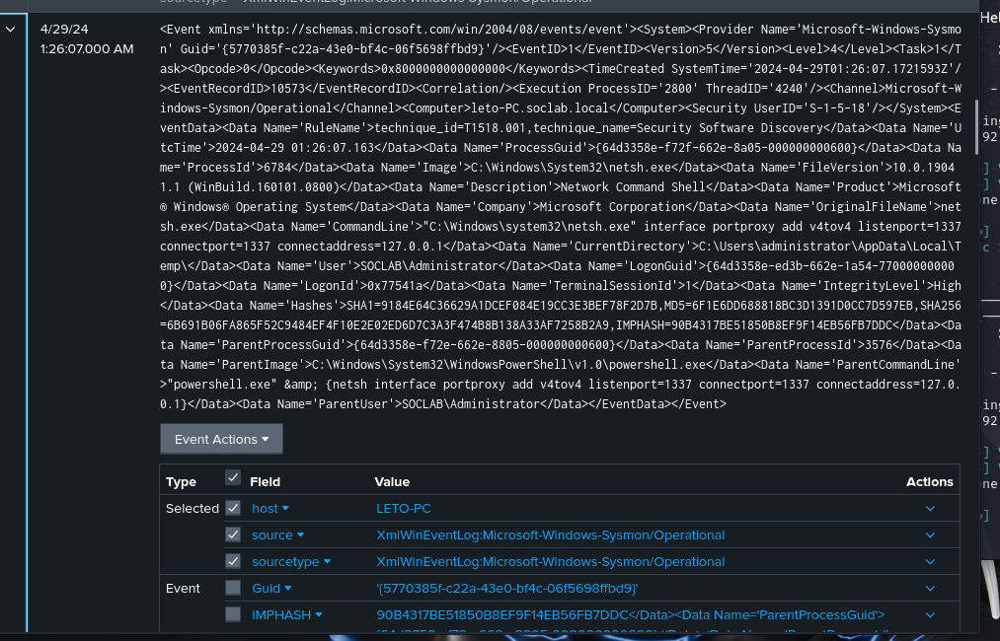
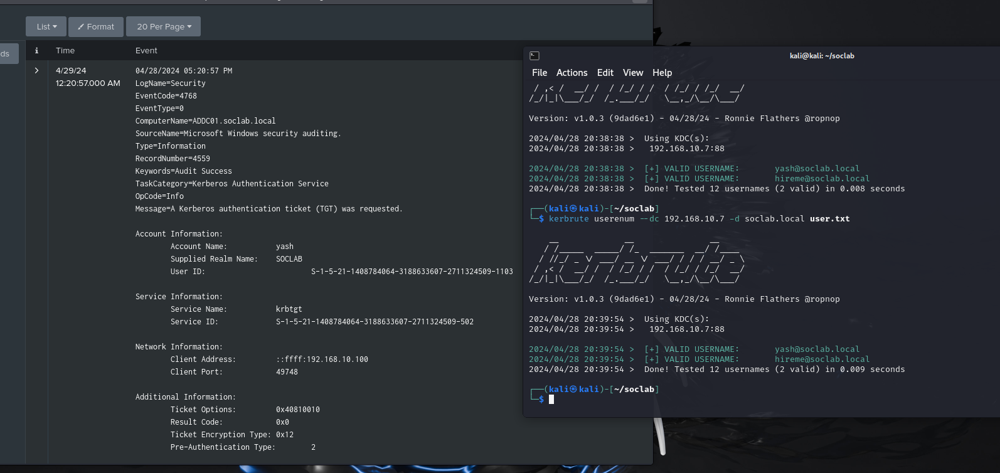

# Mitre ATT&CK Critical Techniques Detection with Splunk

This repository contains Splunk detection confirmation screenshots for critical techniques from the Mitre ATT&CK framework. The screenshots demonstrate successful detection of these techniques using Splunk.

## Table of Contents

- [Introduction](#introduction)
- [Included Techniques](#included-techniques)
- [Usage](#usage)
- [Contributing](#contributing)

## Introduction

The Mitre ATT&CK framework is a comprehensive knowledge base of adversary tactics and techniques based on real-world observations. These techniques are organized into tactics, providing security professionals with valuable insights into the behaviors and methods used by threat actors.

This repository aims to provide confirmation of successful detection for critical techniques identified by Mitre ATT&CK, leveraging the capabilities of Splunk for security monitoring and analysis.

## Included Techniques
### T1562.001: Impair Defenses: Disable or Modify Tools

#### Overview:

T1562.001 involves adversaries disabling or modifying security tools and mechanisms to evade detection and hinder incident response efforts. By impairing defenses, adversaries can increase their dwell time within a compromised environment, escalate privileges, and execute their objectives without interference from security controls. This technique is commonly used by advanced threat actors to maintain persistence, evade detection, and achieve their strategic goals.

#### Detection:

The screenshot below demonstrates the execution of Atomic Red Team telemetry data, simulating T1562.001 activity by disabling security tools or mechanisms on a Windows system:

The following screenshot confirms the successful detection of the T1562.001 technique using Splunk:

#### Technique Description:

Adversaries may impair defenses by disabling or modifying security tools, such as antivirus software, intrusion detection systems (IDS), endpoint detection and response (EDR) solutions, or security policies and configurations. By disabling or circumventing these security controls, adversaries can evade detection and maintain their foothold within the compromised environment for extended periods.

#### How It Worked:

In this scenario, the Atomic Red Team framework was used to simulate the impairment of security tools or mechanisms on a Windows system. The provided telemetry data demonstrates the execution of commands associated with T1562.001 activity.

Splunk successfully detected this activity by monitoring for changes to security tool configurations, alerts or logs indicating the disabling of security services, or unusual patterns of system behavior indicative of security tool impairment. The detection in Splunk was triggered by correlating relevant logs and analyzing the telemetry data generated by Atomic Red Team.

This confirmation highlights the importance of monitoring for impairments to security tools and mechanisms to detect and respond to potential threats attempting to evade detection and hinder incident response efforts.

### T1112: Modify Registry

#### Overview:

T1112 involves adversaries modifying the Windows Registry to achieve various objectives, such as maintaining persistence, executing malicious code, or altering system configurations. The Windows Registry is a crucial component of the operating system that stores configuration settings, application data, and system preferences. Adversaries may modify registry keys and values to achieve their goals, such as creating or modifying autorun entries, configuring security settings, or disguising malicious activities.

#### Detection:

The screenshot below demonstrates the execution of Atomic Red Team telemetry data, simulating T1112 activity by modifying registry keys on a Windows system:

The following screenshot confirms the successful detection of the T1112 technique using Splunk:

#### Technique Description:

Adversaries may leverage various methods to modify the Windows Registry, including using built-in Windows utilities, executing scripts or commands, or leveraging third-party tools. By modifying registry keys and values, adversaries can persistently execute malicious code, manipulate system settings, or conceal their activities from detection mechanisms.

#### How It Worked:

In this scenario, Atomic Red Team telemetry data was used to simulate the modification of registry keys on a Windows system. The provided telemetry data demonstrates the execution of commands associated with T1112 activity.

Splunk successfully detected this activity by monitoring for changes to registry keys and values, as well as analyzing the telemetry data generated by Atomic Red Team. The detection in Splunk was triggered by correlating relevant logs and identifying suspicious modifications to the Windows Registry.

This confirmation underscores the importance of monitoring for changes to the Windows Registry to detect and respond to potential threats attempting to manipulate system configurations or maintain persistence on compromised systems.
### T1090: Connection Proxy

#### Overview:

T1090 involves adversaries using connection proxy tools or services to conceal their activities by routing their network traffic through intermediate servers. By leveraging connection proxies, adversaries can obfuscate their true source IP addresses, evade network security controls, and hide their malicious activities within legitimate traffic. Connection proxies are commonly used for command and control (C2) communication, exfiltration of sensitive data, and bypassing network filtering mechanisms.

#### Detection:

The screenshot below demonstrates the execution of Atomic Red Team telemetry data, simulating T1090 activity by using a connection proxy tool to establish communication with an external server:

The following screenshot confirms the successful detection of the T1090 technique using Splunk:

#### Technique Description:

Adversaries may leverage various connection proxy tools and services, including both open-source and commercial solutions, to conceal their network traffic. These tools typically function by relaying network traffic through intermediate servers, which can be controlled by the adversaries or third-party providers. By routing their traffic through connection proxies, adversaries can hide their true source IP addresses and evade network-based detection and blocking mechanisms.

#### How It Worked:

In this scenario, the Atomic Red Team framework was used to simulate the use of a connection proxy tool to establish communication with an external server. The provided telemetry data demonstrates the execution of commands associated with T1090 activity.

Splunk successfully detected this activity by monitoring for network traffic patterns indicative of connection proxy usage, such as unusual patterns of outgoing connections or connections to known proxy server IPs. The detection in Splunk was triggered by correlating relevant logs and analyzing the telemetry data generated by Atomic Red Team.

This confirmation underscores the importance of monitoring for connection proxy usage to detect and respond to potential threats attempting to conceal their network activities and bypass network security controls.

### T1059: Command and Scripting Interpreter

#### Overview:

T1059 refers to the use of command-line interfaces or scripting interpreters to execute commands. Adversaries may abuse legitimate command-line utilities or scripting languages like PowerShell, Command Prompt, or Bash to interact with systems, execute commands, and perform various tasks. This technique is commonly used by adversaries for execution, lateral movement, persistence, and data exfiltration.

#### Detection:

The screenshot below demonstrates the execution of the Atomic Red Team telemetry data, simulating T1059 activity using the command-line interface on a Windows system:

The following screenshot confirms the successful detection of the T1059 technique using Splunk:

#### Technique Description:

To perform this technique, adversaries typically leverage built-in command-line tools or scripting languages available on the target system. By executing commands or scripts through these interfaces, adversaries can interact with the operating system, manipulate files, modify configurations, execute payloads, and perform other actions.

#### How It Worked:

In this scenario, the Atomic Red Team framework was used to simulate the execution of commands via a command-line interface on a Windows system. The provided telemetry data demonstrates the invocation of commands associated with T1059 activity.

Splunk successfully detected this activity by monitoring for command-line execution events or PowerShell activity indicative of T1059 behavior. The detection in Splunk was triggered by correlating relevant logs and analyzing the telemetry data generated by Atomic Red Team.

This confirmation reinforces the effectiveness of Splunk in detecting and responding to T1059 activity, enabling security teams to identify and mitigate potential threats in their environments.

### T1003: OS Credential Dumping

#### Overview:

T1003 involves adversaries dumping credentials from the operating system, allowing them to obtain account credentials, such as user passwords, hashes, tokens, and keys. Credential dumping techniques can grant adversaries unauthorized access to sensitive resources and facilitate lateral movement within a network.

#### Detection:

The screenshot below demonstrates the execution of the Atomic Red Team telemetry data, simulating T1003 activity on a Windows system:

The following screenshot confirms the successful detection of the T1003 technique using Splunk:

#### Technique Description:

Adversaries use various techniques to dump credentials from the operating system, including memory dumping, registry manipulation, and credential harvesting. These techniques exploit vulnerabilities or misconfigurations in the target system to extract credential information.

#### How It Worked:

In this scenario, the Atomic Red Team framework was used to simulate the dumping of credentials from a Windows system. The provided telemetry data demonstrates the execution of commands associated with T1003 activity.

Splunk successfully detected this activity by monitoring for events indicative of credential dumping behavior. The detection in Splunk was triggered by correlating relevant logs and analyzing the telemetry data generated by Atomic Red Team.

This confirmation underscores the importance of detecting and mitigating credential dumping techniques to prevent unauthorized access and protect sensitive information in enterprise environments.

### Kerbrute User Enumeration Attack

#### Overview:

Kerbrute is a popular tool used by adversaries to perform user enumeration attacks against Active Directory environments. By leveraging the Kerberos protocol, attackers attempt to enumerate valid user accounts within the domain, gathering information that can be used for further exploitation, such as credential spraying or targeted phishing attacks.

#### Detection:

The screenshot below demonstrates the execution of Kerbrute, simulating a user enumeration attack against an Active Directory environment:

#### Technique Description:

In a Kerbrute user enumeration attack, adversaries leverage the Kerberos protocol to request service tickets for a list of potential usernames. By observing the response from the domain controller, attackers can determine which usernames are valid, allowing them to identify valid user accounts within the domain.

#### How It Worked:

In this scenario, Kerbrute was used to perform a user enumeration attack against an Active Directory environment. The provided telemetry data demonstrates the execution of Kerbrute commands and the enumeration of user accounts.

Splunk successfully detected this activity by monitoring for authentication and authorization events related to Kerberos authentication. The detection in Splunk was triggered by correlating relevant logs and analyzing the telemetry data generated by Kerbrute.

This confirmation highlights the importance of monitoring for user enumeration attacks to detect and respond to potential threats targeting Active Directory environments.

## Usage

These screenshots demonstrate the effectiveness of Splunk in detecting critical techniques from the Mitre ATT&CK framework. To implement similar detection capabilities in your environment, review the provided screenshots and configure Splunk according to your organization's requirements.

## Contributing

Contributions to this repository are welcome! If you have additional confirmation screenshots for other techniques, improvements, or feedback, please open an issue or submit a pull request.

