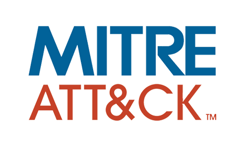

# Mitre-ATTACK-Critical-Techniques-Splunk-Detection
Mitre-ATTACK-Critical-Techniques-Splunk-Detection
# Mitre ATT&CK Critical Techniques Detection with Splunk

This repository contains Splunk detection confirmation screenshots for critical techniques from the Mitre ATT&CK framework. The screenshots demonstrate successful detection of these techniques using Splunk.

## Table of Contents

- [Introduction](#introduction)
- [Included Techniques](#included-techniques)
- [Usage](#usage)
- [Contributing](#contributing)

## Introduction

The Mitre ATT&CK framework is a comprehensive knowledge base of adversary tactics and techniques based on real-world observations. These techniques are organized into tactics, providing security professionals with valuable insights into the behaviors and methods used by threat actors.

This repository aims to provide confirmation of successful detection for critical techniques identified by Mitre ATT&CK, leveraging the capabilities of Splunk for security monitoring and analysis.

## Included Techniques

### T1059: Command and Scripting Interpreter

#### Overview:

T1059 refers to the use of command-line interfaces or scripting interpreters to execute commands. Adversaries may abuse legitimate command-line utilities or scripting languages like PowerShell, Command Prompt, or Bash to interact with systems, execute commands, and perform various tasks. This technique is commonly used by adversaries for execution, lateral movement, persistence, and data exfiltration.

#### Detection:

The screenshot below demonstrates the execution of the Atomic Red Team telemetry data, simulating T1059 activity using the command-line interface on a Windows system:

The following screenshot confirms the successful detection of the T1059 technique using Splunk:

#### Technique Description:

To perform this technique, adversaries typically leverage built-in command-line tools or scripting languages available on the target system. By executing commands or scripts through these interfaces, adversaries can interact with the operating system, manipulate files, modify configurations, execute payloads, and perform other actions.

#### How It Worked:

In this scenario, the Atomic Red Team framework was used to simulate the execution of commands via a command-line interface on a Windows system. The provided telemetry data demonstrates the invocation of commands associated with T1059 activity.

Splunk successfully detected this activity by monitoring for command-line execution events or PowerShell activity indicative of T1059 behavior. The detection in Splunk was triggered by correlating relevant logs and analyzing the telemetry data generated by Atomic Red Team.

This confirmation reinforces the effectiveness of Splunk in detecting and responding to T1059 activity, enabling security teams to identify and mitigate potential threats in their environments.

### T1003: OS Credential Dumping

#### Confirmation of Detection:

The screenshot above confirms successful detection of the T1003 technique using Splunk.

---

[Continue adding sections for each technique...]

## Usage

These screenshots demonstrate the effectiveness of Splunk in detecting critical techniques from the Mitre ATT&CK framework. To implement similar detection capabilities in your environment, review the provided screenshots and configure Splunk according to your organization's requirements.

## Contributing

Contributions to this repository are welcome! If you have additional confirmation screenshots for other techniques, improvements, or feedback, please open an issue or submit a pull request.

